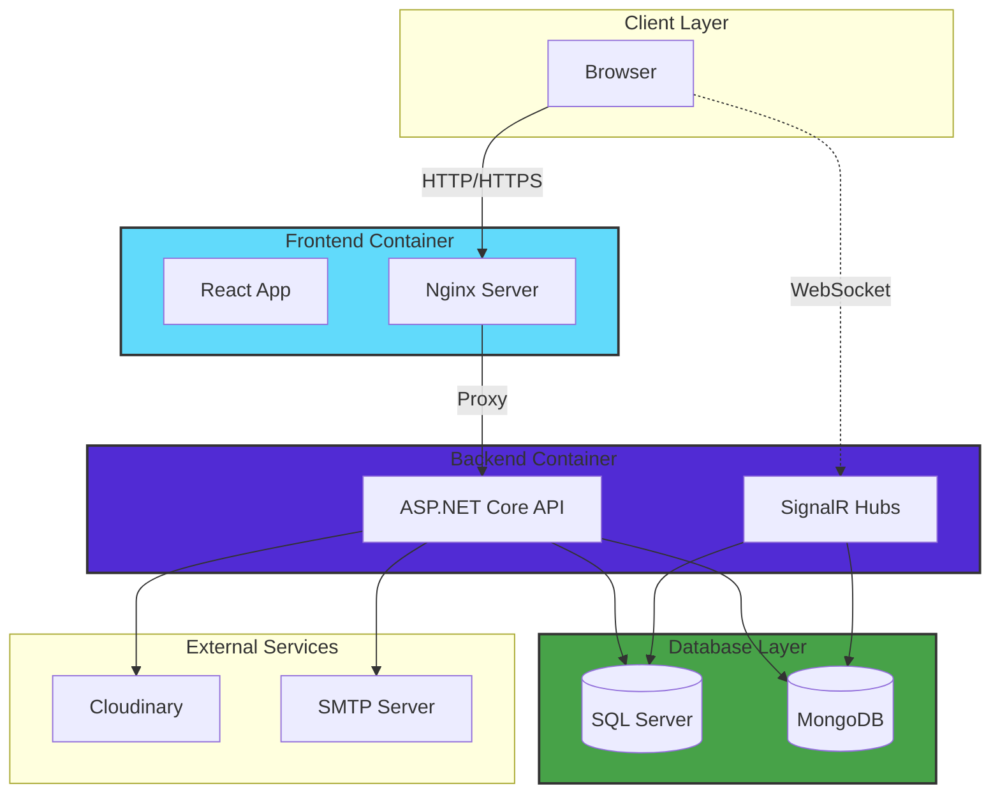
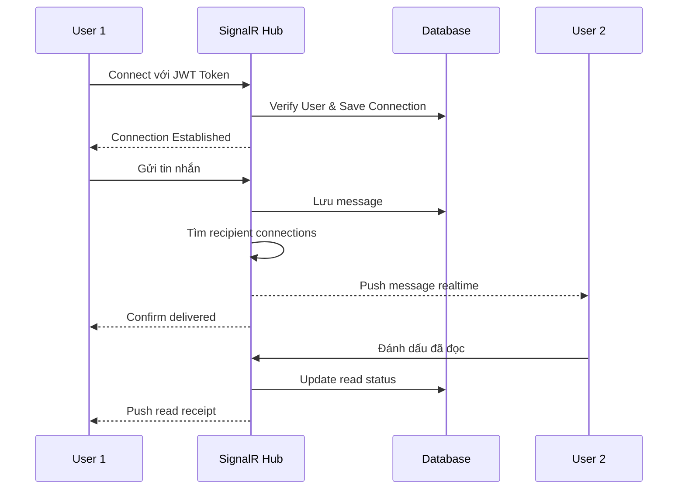
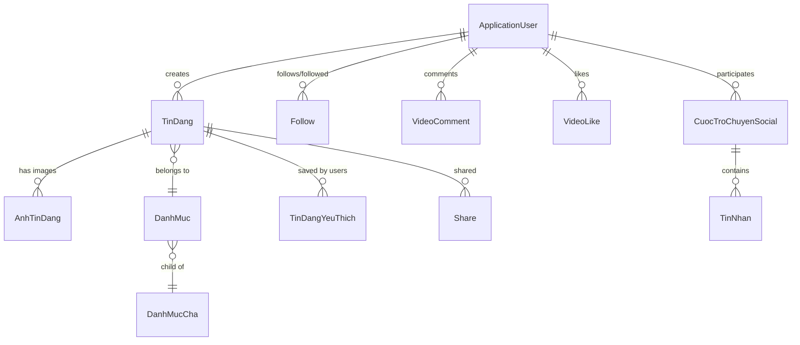

# 🏪 UniMarket - Nền Tảng Thương Mại Xã Hội Toàn Diện

> **Nền tảng mạng xã hội kết hợp marketplace, video ngắn, và AI - Giải pháp hoàn chỉnh cho cộng đồng mua bán và kết nối**


---

## 📖 Giới thiệu

**UniMarket** là một nền tảng thương mại xã hội full-stack kết hợp:
- 🛒 **Marketplace** - Mua bán đồ cũ với nhiều danh mục (Điện tử, Nhà trọ, v.v.)
- 🎥 **Video ngắn** - Nền tảng chia sẻ video kiểu TikTok với AI recommendations
- 👥 **Mạng xã hội** - Kết nối, theo dõi, chia sẻ nội dung
- 💬 **Chat realtime** - Hệ thống chat kép cho marketplace và social
- 🤖 **AI/ML** - Gợi ý thông minh, phân tích giá, phát hiện xu hướng
- 📊 **Admin Dashboard** - Quản lý toàn diện users, posts, reports

Dự án được xây dựng với kiến trúc hiện đại, sử dụng Docker để triển khai dễ dàng, SignalR cho real-time communication, và hybrid database (SQL Server + MongoDB) để tối ưu hiệu năng.

---

## 📋 Mục lục

- [Tính năng nổi bật](#-tính-năng-nổi-bật)
- [Tech Stack](#-tech-stack)
- [Kiến trúc hệ thống](#-kiến-trúc-hệ-thống)
- [Yêu cầu hệ thống](#-yêu-cầu-hệ-thống)
- [Cài đặt & Chạy dự án](#-cài-đặt--chạy-dự-án)
- [Cấu trúc dự án](#-cấu-trúc-dự-án)
- [API Documentation](#-api-documentation)
- [Database Schema](#-database-schema)
- [Troubleshooting](#-troubleshooting)
- [Điểm nổi bật cho Nhà tuyển dụng](#-điểm-nổi-bật-cho-nhà-tuyển-dụng)

---

## ✨ Tính năng nổi bật

### 🎥 Nền tảng Video Ngắn (TikTok-like)

- **Video Feed với AI**: Luồng video dọc với thuật toán gợi ý dựa trên lịch sử xem
- **Swipe Navigation**: Vuốt lên/xuống để xem video tiếp theo
- **Video Player Pro**: Controls đầy đủ (play/pause, volume, fullscreen, progress bar)
- **Tương tác xã hội**: Like, comment, share videos
- **Video Upload**: Upload video với mô tả, hashtags
- **Comments Drawer**: Hệ thống comment realtime với replies
- **Video Search**: Tìm kiếm video theo nội dung, user, hashtags
- **Trending Videos**: Video xu hướng dựa trên engagement
- **View History**: Theo dõi lịch sử xem với MongoDB
- **Video Analytics**: Tracking views, likes, shares, completion rate

### 🛒 Marketplace Đa Danh Mục

- **Đăng tin chi tiết**: Hình ảnh carousel, giá, mô tả, thông số kỹ thuật
- **Danh mục phân cấp**: Parent categories và subcategories
  - 📱 Điện tử (Laptop, Điện Thoại, Máy Tính Bảng, v.v.)
  - 🏠 Nhà Trọ (cho thuê phòng trọ với thông tin chi tiết)
  - Và nhiều danh mục khác
- **Advanced Filters**: Lọc theo giá, vị trí, danh mục, tình trạng
- **Location-based Search**: Tìm kiếm theo tỉnh/thành, quận/huyện
- **Save Posts**: Lưu tin đăng yêu thích
- **Price Analysis**: AI phân tích giá thị trường
- **Similar Posts**: Gợi ý sản phẩm tương tự
- **Post Management**: Quản lý tin đăng (sửa, xóa, ẩn)

### 👥 Mạng Xã Hội

- **User Profiles**: Trang cá nhân với avatar, bio, social links
- **Follow System**: Theo dõi/Bỏ theo dõi users
- **Smart Recommendations**: Gợi ý người dùng để follow
- **Activity Feed**: Xem hoạt động của người bạn theo dõi
- **User Search**: Tìm kiếm người dùng
- **Profile Customization**: Cập nhật thông tin, avatar, cover photo
- **Social Links**: Kết nối Facebook, Instagram, v.v.
- **User Statistics**: Followers, following, posts count

### 💬 Hệ Thống Chat Kép với SignalR

#### Chat Marketplace (Mua bán)
- Real-time messaging giữa người mua và người bán
- Product context trong chat (hiển thị sản phẩm đang trao đổi)
- Gửi hình ảnh, files
- Message status: sent, delivered, read
- Quick messages/templates

#### Social Chat (Bạn bè)
- Chat 1-1 giữa friends
- Group chat support
- Media sharing (photos, videos)
- Message reactions (emoji)
- Message editing và deletion
- Typing indicators
- Online/offline status
- Message search trong conversation
- Pin conversations

**Tính năng chung:**
- Unread count badges
- Push notifications
- Chat list với preview
- Block/Unblock users
- Message threading
- Auto-scroll to latest

### 🔔 Hệ Thống Thông Báo Real-time

- **Notification Types**:
  - 👍 Ai đó like post/video của bạn
  - 💬 Comment mới
  - 👥 Follow/Unfollow
  - 💌 Tin nhắn mới
  - 📢 Mentions
  - 🛒 Cập nhật đơn hàng
- **Notification Hub**: SignalR push realtime
- **Notification Center**: Xem tất cả thông báo
- **Mark as Read/Unread**
- **Notification History**
- **Settings**: Bật/tắt từng loại thông báo
- **Badge Counts**: Hiển thị số thông báo chưa đọc

### 🤖 AI & Machine Learning

- **Video Recommendations**: Thuật toán gợi ý video dựa trên:
  - Lịch sử xem
  - Likes/Comments
  - User preferences
  - Video similarity
- **Product Recommendations**: Gợi ý sản phẩm phù hợp
- **Price Analysis**: Phân tích xu hướng giá thị trường
- **Trending Detection**: Phát hiện video/sản phẩm đang trending
- **Smart Search**: Gợi ý tìm kiếm thông minh
- **User Behavior Analytics**: Phân tích hành vi người dùng
- **Content Filtering**: Lọc nội dung không phù hợp

### 🔍 Tìm Kiếm & Khám Phá Nâng Cao

- **Multi-type Search**: Tìm kiếm products, videos, users
- **Advanced Filters**:
  - Giá: Min/Max range với slider
  - Địa điểm: Tỉnh/thành, Quận/huyện
  - Danh mục: Multi-level categories
  - Tình trạng: Mới, cũ, like new
  - Sắp xếp: Mới nhất, giá thấp/cao, gần nhất
- **Search History**: Lưu lịch sử tìm kiếm
- **Trending Keywords**: Từ khóa hot nhất
- **Search Suggestions**: Autocomplete với MongoDB full-text search
- **Related Searches**: Tìm kiếm liên quan
- **Search Analytics**: Tracking search behavior

### 🛡️ Report & Moderation System

- **Report Types**: Posts, Videos, Comments, Users
- **Report Reasons**:
  - Spam
  - Scam/Fraud
  - Inappropriate content
  - Harassment
  - Copyright violation
  - Other
- **Admin Review Queue**: Xử lý reports
- **Content Moderation**: Ẩn/Xóa nội dung vi phạm
- **User Actions**: Warning, Suspend, Ban
- **Report Statistics**: Analytics về reports

### 📊 Admin Dashboard

- **User Management**:
  - View all users với pagination
  - Edit user profiles
  - Suspend/Activate accounts
  - Delete users
  - View user statistics
- **Employee Management**:
  - Add/Remove employees
  - Role-based access control
  - Employee activity logs
- **Category Management**:
  - Create parent categories
  - Add/Edit/Delete subcategories
  - Category ordering
- **Content Moderation**:
  - Review reported posts/videos
  - Approve/Reject content
  - Bulk actions
- **Analytics Dashboard**:
  - User growth charts
  - Revenue tracking (if applicable)
  - Popular categories
  - Engagement metrics
- **System Configuration**:
  - Site settings
  - Email templates
  - Feature toggles

### 📍 Tính Năng Dựa Trên Vị Trí

- **Location Filters**: Tìm kiếm theo tỉnh/thành, quận/huyện
- **Map Integration**: Leaflet maps hiển thị vị trí
- **Nearby Listings**: Sản phẩm gần bạn
- **Distance Calculation**: Tính khoảng cách
- **Location Autocomplete**: Gợi ý địa điểm

### 💾 Tính Năng Tương Tác Người Dùng

- **Save/Bookmark**: Lưu posts và videos yêu thích
- **View History**: Theo dõi lịch sử xem (MongoDB)
- **Like/Unlike**: Like posts, videos, comments
- **Share**: Chia sẻ lên Facebook, Copy link
- **Comment Threads**: Comments với replies
- **User Preferences**: Lưu preferences

---

## 🛠 Tech Stack

### **Frontend** 

#### Core
- **React 19** - UI Framework
- **Vite** - Build tool & Dev server
- **React Router v7** - Client-side routing

#### UI & Styling
- **Bootstrap 5** - CSS Framework
- **Ant Design** - UI Components (nếu có)
- **Material-UI (@mui/material)** - UI Components
- **FontAwesome** - Icons
- **React Icons** - Icon library
- **Lucide React** - Modern icons
- **Animate.css** - Animations

#### State & Data
- **Axios** - HTTP client
- **JWT Decode** - Token handling
- **React Context API** - State management

#### Real-time Communication
- **@microsoft/signalr** - SignalR client cho real-time features

#### Media & Maps
- **Leaflet** / **React Leaflet** - Maps
- **Swiper** - Carousels
- **fslightbox-react** - Image lightbox

#### Utilities
- **date-fns** - Date formatting
- **React Hot Toast** - Notifications
- **React Toastify** - Toast notifications
- **Sonner** - Toast library
- **SweetAlert2** - Modal dialogs
- **Recharts** - Charts & Analytics

#### Development
- **ESLint** - Code linting
- **@vitejs/plugin-react** - Vite React plugin

#### Web Server
- **Nginx** - Reverse proxy & static file serving (trong Docker)

---

### **Backend**

#### Core Framework
- **ASP.NET Core 9.0** - Web API Framework
- **C#** - Programming language

#### Architecture & Patterns
- **Clean Architecture** - Separation of concerns
- **Repository Pattern** - Data access abstraction
- **Dependency Injection** - IoC container

#### Authentication & Security
- **JWT Bearer Token** - Stateless authentication
- **ASP.NET Identity** - User management
- **IdentityUser** - User entity
- **Password Hashing** - Bcrypt/PBKDF2

#### Database & ORM
- **Entity Framework Core** - ORM
- **SQL Server 2022** - Relational database
- **MongoDB Driver** - NoSQL operations
- **EF Migrations** - Database versioning

#### Real-time Communication
- **SignalR Core** - WebSocket abstraction
- **SignalR Hubs**:
  - `ChatHub` - Marketplace chat
  - `SocialChatHub` - Social messaging
  - `NotificationHub` - Notifications
  - `VideoHub` - Video interactions
  - `UserNotificationHub` - User notifications
  - `CommentHub` - Comment updates

#### Cloud Services
- **Cloudinary** - Media storage & CDN
- **SMTP** - Email sending

#### API & Documentation
- **Swagger/OpenAPI** - API documentation
- **Swashbuckle** - Swagger generator

#### Business Logic Services
- `UserNotificationService` - User notifications
- `VideoRecommendationService` - AI recommendations
- `PriceAnalysisService` - Price analytics
- `UserBehaviorService` - Behavior tracking
- `SearchService` - Search với MongoDB
- `RecommendationEngine` - AI/ML engine

---

### **Databases**

#### SQL Server 2022 (Relational Data)
- Users & Authentication
- Products (`TinDang`)
- Categories (`DanhMuc`, `DanhMucCha`)
- Follows
- Likes
- Reports
- Notifications
- Shares

#### MongoDB (Document Store)
- Chat Messages
- Video View Logs (`VideoViewLog`)
- Search History (`SearchLog`)
- View History (`ViewHistory`)
- Product Details (`TinDangDetail`)
- Housing Details (`NhaTroDetail`)

---

### **DevOps & Infrastructure**

- **Docker** - Containerization
- **Docker Compose** - Multi-container orchestration
- **Nginx** - Reverse proxy
- **.env** - Environment configuration
- **Database Seeding** - Auto-restore from backups

---

## 🏗 Kiến trúc hệ thống

### Tổng quan Architecture



### Real-time Communication Flow



### Database Relationships (Simplified)



---

## 💻 Yêu cầu hệ thống

Trước khi bắt đầu, đảm bảo máy tính của bạn đã cài đặt:

| Tool | Version | Download |
|------|---------|----------|
| **Docker Desktop** | Latest | [Download](https://www.docker.com/products/docker-desktop/) |
| **Git** | 2.x+ | [Download](https://git-scm.com/downloads) |

> **Lưu ý**: Bạn **KHÔNG CẦN** cài Node.js, .NET SDK, SQL Server hay MongoDB. Mọi thứ đều chạy trong Docker! 🐳

**Cấu hình đề xuất:**
- RAM: 8GB+ (16GB recommended)
- Disk Space: 10GB+ free
- OS: Windows 10/11, macOS, hoặc Linux

---

## 🚀 Cài đặt & Chạy dự án

### **Bước 1: Clone repository**

```bash
git clone https://github.com/DinhCNTT/unimarket-fullstack.git
cd unimarket-fullstack
```

### **Bước 2: Cấu hình Environment Variables**

File `.env.example` đã có sẵn. Copy và đổi tên:

```bash
cp .env.example .env
```

Nếu cần, cập nhật các biến trong `.env`:
- Database credentials
- JWT secret key
- Cloudinary API keys (nếu muốn upload thật)
- Google OAuth Client ID
- SMTP settings

### **Bước 3: Khởi động Docker Desktop**

- **Windows/Mac**: Mở ứng dụng Docker Desktop
- **Linux**: `sudo systemctl start docker`

### **Bước 4: Chạy toàn bộ ứng dụng**

```bash
docker-compose up --build
```

> **Lần đầu chạy** sẽ mất khoảng 3-5 phút để tải images và build. Các lần sau chỉ mất ~30 giây.

**Quá trình khởi động:**
1. ✅ SQL Server container starts
2. ✅ MongoDB container starts  
3. ✅ Database seeding (restore backup)
4. ✅ Backend API starts
5. ✅ Frontend build & starts
6. ✅ Nginx serves frontend

### **Bước 5: Truy cập ứng dụng**

Sau khi thấy log `✅ Application started`, mở trình duyệt:

| Service | URL | Mô tả |
|---------|-----|-------|
| **Frontend** | http://localhost:3000 | Giao diện web chính |
| **Backend API** | http://localhost:5133 | REST API |
| **Swagger UI** | http://localhost:5133/swagger | API Documentation |
| **SQL Server** | `localhost:1433` | User: `sa` / Pass: `StrongPassword123!` |
| **MongoDB** | `localhost:27017` | No authentication |

### **Bước 6: Đăng nhập thử nghiệm**

Hệ thống đã có sẵn tài khoản demo:

```
Email: demo@unimarket.com
Password: Demo123!
```

hoặc đăng ký tài khoản mới!

---

## 📁 Cấu trúc dự án

```
unimarket-fullstack/
├── unimarket/                    # Frontend (React + Vite)
│   ├── src/
│   │   ├── components/          # React components
│   │   │   ├── AI/              # AI-related components
│   │   │   ├── AccountSettings/ # Settings UI
│   │   │   ├── ChatBanHang/     # Marketplace chat
│   │   │   ├── SocialChatViewer/# Social chat
│   │   │   ├── VideoPlayer/     # Video player
│   │   │   ├── VideoSearch/     # Video search
│   │   │   ├── NotificationDropdown/
│   │   │   └── TopNavbar/       # Navigation
│   │   ├── pages/               # Page components
│   │   │   ├── VideoPage.jsx    # TikTok-like video feed
│   │   │   ├── ExplorePage/     # Explore content
│   │   │   ├── UserProfilePage/ # User profiles
│   │   │   ├── MarketPage.jsx   # Marketplace
│   │   │   ├── TrangChat.jsx    # Chat page
│   │   │   └── Admin/           # Admin pages
│   │   ├── context/             # React Contexts
│   │   │   ├── AuthContext.jsx
│   │   │   ├── VideoContext.jsx
│   │   │   ├── NotificationContext.jsx
│   │   │   └── ...
│   │   ├── services/            # API calls
│   │   │   ├── api.js
│   │   │   ├── chatSocialService.js
│   │   │   └── videoService.js
│   │   ├── hooks/               # Custom hooks
│   │   └── App.jsx              # Root component
│   ├── Dockerfile               # Multi-stage build
│   ├── nginx.conf               # Nginx config
│   └── package.json
│
├── UniMarket-Backend/           # Backend (.NET 9.0)
│   └── UniMarket/
│       ├── Controllers/         # API Controllers
│       │   ├── AuthController.cs
│       │   ├── TinDangController.cs
│       │   ├── VideoController.cs
│       │   ├── ChatController.cs
│       │   ├── SocialShareController.cs
│       │   ├── FollowController.cs
│       │   ├── NotificationsController.cs
│       │   ├── ReportsController.cs
│       │   ├── AdminController.cs
│       │   └── ...
│       ├── Hubs/                # SignalR Hubs
│       │   ├── ChatHub.cs
│       │   ├── SocialChatHub.cs
│       │   ├── NotificationHub.cs
│       │   └── VideoHub.cs
│       ├── Models/              # Entities
│       │   ├── ApplicationUser.cs
│       │   ├── TinDang.cs
│       │   ├── DanhMuc.cs
│       │   ├── Follow.cs
│       │   ├── VideoComment.cs
│       │   └── Mongo/           # MongoDB models
│       ├── Services/            # Business logic
│       │   ├── VideoRecommendationService.cs
│       │   ├── PriceAnalysisService.cs
│       │   ├── UserBehaviorService.cs
│       │   └── ...
│       ├── DTO/                 # Data Transfer Objects
│       ├── DataAccess/          # DbContext
│       ├── Helpers/             # Utility classes
│       ├── Dockerfile           # Multi-stage build
│       └── Program.cs           # Entry point
│
├── database/                    # Database seeds
│   ├── unimarket.bak           # SQL Server backup
│   ├── mongo-dump/             # MongoDB dump
│   ├── restore.sql             # Restore script
│   ├── install.sh              # SQL seeder
│   └── install-mongo.sh        # Mongo seeder
│
├── docker-compose.yml          # Orchestration
├── .env.example                # Environment template
├── .gitignore                  # Git ignore rules
└── README.md                   # This file
```

---

## 🔌 API Documentation

### **Authentication**
```http
POST   /api/auth/register          # Đăng ký tài khoản mới
POST   /api/auth/login             # Đăng nhập
POST   /api/auth/refresh           # Refresh token
POST   /api/auth/logout            # Đăng xuất
GET    /api/auth/verify-email      # Xác thực email
```

### **Products (TinDang)**
```http
GET    /api/tindang                # Lấy danh sách sản phẩm (có filter)
GET    /api/tindang/{id}           # Chi tiết sản phẩm
POST   /api/tindang                # Tạo sản phẩm mới (Auth)
PUT    /api/tindang/{id}           # Cập nhật sản phẩm (Auth)
DELETE /api/tindang/{id}           # Xóa sản phẩm (Auth)
GET    /api/tindang/search         # Tìm kiếm nâng cao
GET    /api/tindang/similar/{id}   # Sản phẩm tương tự
POST   /api/tindang/yeuthich       # Lưu sản phẩm
DELETE /api/tindang/yeuthich/{id}  # Bỏ lưu
```

### **Videos**
```http
GET    /api/video/feed             # Video feed (AI recommendations)
GET    /api/video/{id}             # Video details
POST   /api/video/upload           # Upload video (Auth)
PUT    /api/video/{id}             # Update video (Auth)
DELETE /api/video/{id}             # Delete video (Auth)
POST   /api/video/like             # Like/Unlike video
GET    /api/video/trending         # Trending videos
GET    /api/video/search           # Search videos
POST   /api/video/view             # Track video view
GET    /api/video/history          # View history
```

### **Video Comments**
```http
GET    /api/video/{id}/comments    # Get video comments
POST   /api/video/comment          # Comment on video
PUT    /api/video/comment/{id}     # Edit comment
DELETE /api/video/comment/{id}     # Delete comment
POST   /api/video/comment/like     # Like comment
```

### **Social Features**
```http
POST   /api/follow                 # Follow user
DELETE /api/follow/{userId}        # Unfollow user
GET    /api/follow/followers       # Get followers
GET    /api/follow/following       # Get following
GET    /api/follow/suggestions     # Follow suggestions
```

### **User Profiles**
```http
GET    /api/user/profile/{id}      # Get user profile
PUT    /api/user/profile           # Update own profile (Auth)
POST   /api/user/avatar            # Upload avatar
POST   /api/user/cover             # Upload cover photo
GET    /api/user/{id}/posts        # Get user's posts
GET    /api/user/{id}/videos       # Get user's videos
```

### **Chat**
```http
GET    /api/chat/conversations     # Danh sách cuộc trò chuyện
GET    /api/chat/messages/{id}     # Lấy tin nhắn
POST   /api/chat/send              # Gửi tin nhắn
PUT    /api/chat/read/{id}         # Đánh dấu đã đọc
DELETE /api/chat/message/{id}      # Xóa tin nhắn
POST   /api/chat/block             # Block user
```

### **Social Chat**
```http
GET    /api/socialchat/conversations    # Social conversations
POST   /api/socialchat/create           # Create conversation
POST   /api/socialchat/send             # Send message
PUT    /api/socialchat/edit/{id}        # Edit message
DELETE /api/socialchat/delete/{id}      # Delete message
POST   /api/socialchat/react            # React to message
```

### **Notifications**
```http
GET    /api/notifications          # Get user notifications
PUT    /api/notifications/read     # Mark as read
PUT    /api/notifications/read-all # Mark all as read
DELETE /api/notifications/{id}     # Delete notification
GET    /api/notifications/unread-count # Unread count
```

### **Reports**
```http
POST   /api/reports                # Submit report
GET    /api/reports                # Get user's reports
GET    /api/reports/admin          # Get all reports (Admin)
PUT    /api/reports/{id}/resolve   # Resolve report (Admin)
DELETE /api/reports/{id}           # Delete report
```

### **Categories**
```http
GET    /api/category               # Get all categories
GET    /api/category/{id}          # Get category by ID
POST   /api/category               # Create category (Admin)
PUT    /api/category/{id}          # Update category (Admin)
DELETE /api/category/{id}          # Delete category (Admin)
```

### **Search & Trending**
```http
GET    /api/search                 # Universal search
GET    /api/search/trending        # Trending keywords
GET    /api/search/suggestions     # Search suggestions
POST   /api/search/log             # Log search (for analytics)
```

### **Admin**
```http
GET    /api/admin/users            # Get all users
GET    /api/admin/users/{id}       # Get user details
PUT    /api/admin/users/{id}       # Update user
DELETE /api/admin/users/{id}       # Delete user
POST   /api/admin/users/suspend    # Suspend user
POST   /api/admin/users/activate   # Activate user
GET    /api/admin/statistics       # Dashboard statistics
GET    /api/admin/employees        # Get employees
POST   /api/admin/employees        # Add employee
```

### **Shares**
```http
POST   /api/share                  # Share content
GET    /api/share/{id}/count       # Get share count
```

> 📚 **Xem đầy đủ API docs tại:** http://localhost:5133/swagger

---

## 🗄️ Database Schema

### SQL Server Tables (Main Data)

**Core Tables:**
- `AspNetUsers` - User accounts (Identity)
- `TinDang` - Product listings
- `DanhMuc` - Categories
- `DanhMucCha` - Parent categories
- `AnhTinDang` - Product images
- `Follow` - Follow relationships
- `VideoComment` - Video comments
- `VideoLike` - Video likes
- `TinDangYeuThich` - Saved posts
- `Share` - Shares
- `Report` - User reports
- `Notification` - System notifications
- `UserNotification` - User-specific notifications
- `CuocTroChuyenSocial` - Social conversations
- `TinNhan` - Chat messages
- `QuickMessage` - Quick message templates

**Location Tables:**
- `TinhThanh` - Provinces
- `QuanHuyen` - Districts

**Other:**
- `UserSocialLink` - Social media links
- `UserDevice` - User devices for push notifications
- `BlockedUser` - Blocked users
- `SearchHistory` - Search history

### MongoDB Collections (Logs & Analytics)

- `TinDangDetails` - Product detailed specs
- `NhaTroDetails` - Housing rental details
- `VideoViews` - Video view logs
- `ViewHistory` - User view history
- `SearchLogs` - Search analytics

---

## 🐛 Troubleshooting

### **Lỗi: Port đã bị chiếm**
```bash
Error: bind: address already in use
```
**Giải pháp**: Đổi port trong `docker-compose.yml`:
```yaml
ports:
  - "3001:80"  # Đổi 3000 → 3001 cho frontend
  - "5134:8080"  # Đổi 5133 → 5134 cho backend
```

### **Lỗi: Database không restore được**
```bash
# Xem log của sql-seeder
docker-compose logs sql-seeder

# Restart database
docker-compose restart sqlserver

# Nếu vẫn lỗi, reset database
docker-compose down -v
docker-compose up --build
```

### **Lỗi: Frontend không kết nối được Backend**
Kiểm tra biến môi trường trong `docker-compose.yml`:
```yaml
args:
  VITE_API_URL: http://localhost:5133  # Đảm bảo đúng port
```

### **Lỗi: SignalR không kết nối được**
- Check browser console for WebSocket errors
- Verify JWT token is valid
- Check CORS settings in `Program.cs`
- Ensure SignalR endpoint is correct: `http://localhost:5133/hubs/...`

### **Lỗi: Docker build fails**
```bash
# Clear Docker cache
docker system prune -a

# Rebuild without cache
docker-compose build --no-cache
```

### **Reset toàn bộ dự án**
```bash
# Tắt và xóa tất cả containers + volumes
docker-compose down -v

# Xóa images (nếu cần)
docker-compose down --rmi all

# Chạy lại từ đầu
docker-compose up --build
```

---

## 📝 Lệnh Docker hữu ích

```bash
# Chạy ở chế độ nền (không chiếm terminal)
docker-compose up -d

# Xem logs realtime
docker-compose logs -f

# Xem logs của 1 service
docker-compose logs backend
docker-compose logs frontend
docker-compose logs sqlserver
docker-compose logs mongodb

# Tắt dự án (giữ lại data)
docker-compose down

# Restart 1 service cụ thể
docker-compose restart backend
docker-compose restart frontend

# Xem trạng thái containers
docker-compose ps

# Vào terminal của container
docker exec -it unimarket_backend bash
docker exec -it unimarket_frontend sh
docker exec -it unimarket_sql bash

# Xem resource usage
docker stats

# Backup database
docker exec unimarket_sql /opt/mssql-tools/bin/sqlcmd \
  -S localhost -U sa -P 'StrongPassword123!' \
  -Q "BACKUP DATABASE [UniMarket5] TO DISK='/tmp/backup.bak'"
```

---

## 🎯 Điểm nổi bật cho Nhà tuyển dụng

### 💼 Kỹ Năng & Kinh Nghiệm Thể Hiện

#### **Full-Stack Development**
- ✅ Frontend hiện đại với **React 19** + **Vite**
- ✅ Backend mạnh mẽ với **ASP.NET Core 9.0**
- ✅ Responsive design, mobile-friendly
- ✅ RESTful API design best practices

#### **Real-time Applications**
- ✅ SignalR implementation cho 6 hubs khác nhau
- ✅ WebSocket communication
- ✅ Real-time chat với typing indicators
- ✅ Live notifications push
- ✅ Real-time video interactions

#### **Database Design & Management**
- ✅ **Hybrid Database Strategy**: SQL Server + MongoDB
- ✅ Relational data modeling (SQL Server)
- ✅ NoSQL for logs & analytics (MongoDB)
- ✅ Entity Framework Core với Migrations
- ✅ Database optimization & indexing

#### **AI & Machine Learning**
- ✅ Recommendation engine implementation
- ✅ User behavior analytics
- ✅ Price analysis algorithms
- ✅ Trending detection
- ✅ Smart content filtering

#### **Software Architecture**
- ✅ **Clean Architecture** principles
- ✅ **Repository Pattern**
- ✅ **Dependency Injection**
- ✅ Separation of Concerns
- ✅ SOLID principles
- ✅ Scalable code structure

#### **Security Best Practices**
- ✅ JWT Bearer authentication
- ✅ ASP.NET Identity integration
- ✅ Password hashing
- ✅ Input validation & sanitization
- ✅ CORS configuration
- ✅ XSS & CSRF protection

#### **DevOps & Cloud**
- ✅ **Docker** containerization
- ✅ **Docker Compose** orchestration
- ✅ Multi-stage builds optimization
- ✅ **Nginx** reverse proxy setup
- ✅ Environment configuration
- ✅ Database seeding automation
- ✅ CI/CD ready structure

#### **Third-party Integrations**
- ✅ **Cloudinary** - Media storage & CDN
- ✅ **Google OAuth** - Social login
- ✅ **Leaflet** - Maps integration
- ✅ **Email Services** - SMTP
- ✅ External API integration patterns

#### **Performance Optimization**
- ✅ Lazy loading & code splitting
- ✅ Image optimization
- ✅ Caching strategies
- ✅ Database query optimization
- ✅ CDN for static assets
- ✅ Nginx compression

#### **Testing & Quality**
- ✅ Error handling & logging
- ✅ Exception management
- ✅ Input validation
- ✅ API error responses
- ✅ Console debugging

#### **UI/UX Skills**
- ✅ Modern, professional design
- ✅ Responsive layouts
- ✅ Smooth animations
- ✅ Intuitive navigation
- ✅ Accessibility considerations
- ✅ Toast notifications & feedback

### 📊 Số Liệu Ấn Tượng

- **22+ API Controllers** với hơn 150 endpoints
- **7 SignalR Hubs** cho real-time communication
- **35+ Database Models** (SQL Server)
- **5 MongoDB Collections** cho analytics
- **150+ React Components**
- **8+ Context Providers** cho state management
- **Multi-category** marketplace support
- **TikTok-style** video platform
- **Dual chat system** (marketplace + social)
- **AI-powered** recommendations

### 🚀 Khả Năng Mở Rộng

Dự án được thiết kế để dễ dàng scale:
- Microservices-ready architecture
- Stateless API (JWT)
- Horizontal scaling capability
- CDN integration
- Database sharding potential
- Load balancing ready

---

## 🤝 Contributing

Nếu bạn muốn đóng góp cho dự án:

1. Fork repository này
2. Tạo branch mới: `git checkout -b feature/ten-tinh-nang`
3. Commit thay đổi: `git commit -m 'Thêm tính năng X'`
4. Push lên branch: `git push origin feature/ten-tinh-nang`
5. Tạo Pull Request

---

## 📄 License

Dự án này được phát hành dưới giấy phép **MIT License**.

---

## 👨‍💻 Author

**Đoàn Tuệ Định**  
📧 Email: dinhcm123321@gmail.com  
🔗 GitHub: [@DinhCNTT](https://github.com/DinhCNTT)  
💼 LinkedIn: [linkedin.com/in/dinh-doan](#) *(Cập nhật link LinkedIn của bạn)*

---

## ⭐ Support

Nếu bạn thấy dự án này hữu ích hoặc ấn tượng, hãy cho mình 1 ⭐ trên GitHub nhé! 🙏

**Dự án này thể hiện:**
- Kỹ năng Full-Stack Development chuyên sâu
- Khả năng xây dựng ứng dụng real-time phức tạp
- Hiểu biết về AI/ML integration
- DevOps và containerization
- Database design & optimization
- Clean code & architecture

---

<div align="center">

**Made with ❤️ and lots of ☕ by My Team**

*UniMarket - Where Social Meets Commerce* 🛒🎥💬

</div>
